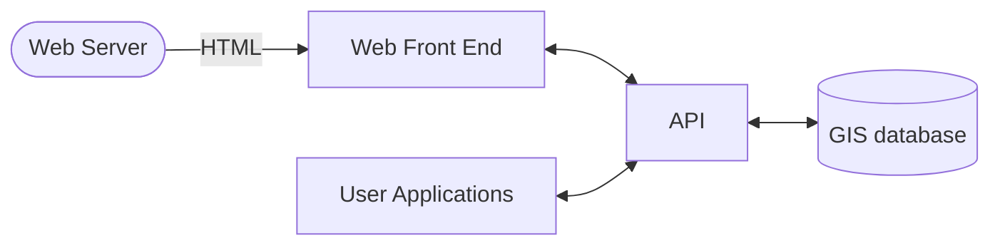
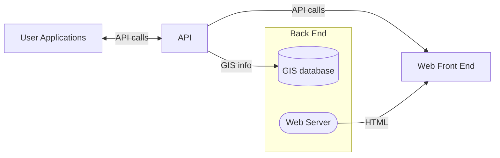

# Challenge 4.1: Mermaid Diagramming

## Part 1: Simple Flowchart

```mermaid
flowchart LR
    WS([Web Server])
    FE[Web Front End]
    UA[User Applications]
    API[API]
    DB[(GIS database)]

    WS -->|HTML| FE
    FE <--> API
    UA <--> API
    API <--> DB
```

## Part 2: Flowchart with Subgraph

```mermaid
flowchart LR
    UA[User Applications]
    API[API]
    FE[Web Front End]

    subgraph BE[Back End]
        direction TB
        DB[(GIS database)]
        WS([Web Server])
    end

    UA <-->|API calls| API
    API -->|API calls| FE
    API -->|GIS info| DB
    WS -->|HTML| FE
```
