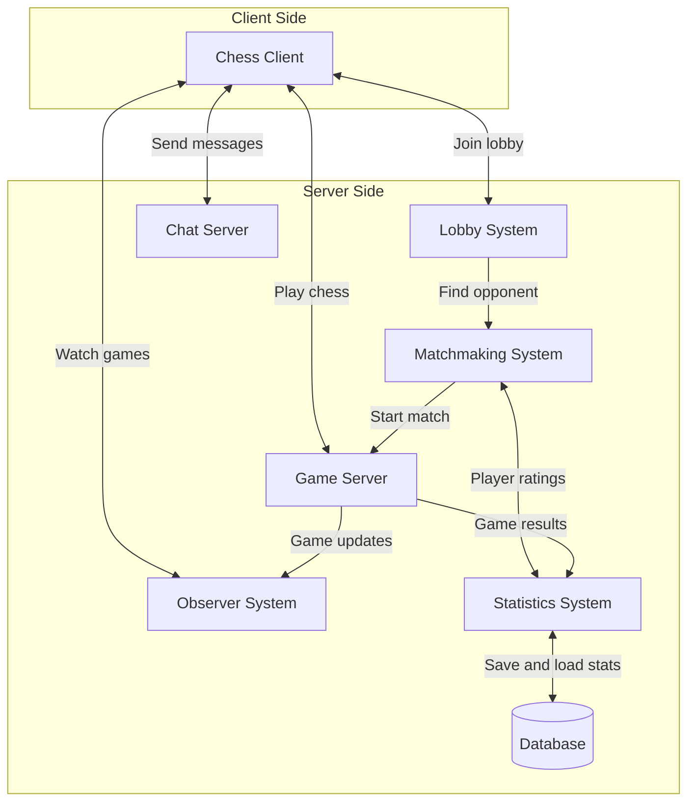

# In-Class Challenge 4.5: Component Diagram

## Component Diagram

```mermaid
flowchart TB
    subgraph Client["Client Side"]
        ChessClient[Chess Client]
    end

    subgraph Server["Server Side"]
        Lobby[Lobby System]
        Matchmaking[Matchmaking System]
        Game[Game Server]
        Chat[Chat Server]
        Observer[Observer System]
        Stats[Statistics System]
        DB[(Database)]
    end

    ChessClient <-->|Join lobby| Lobby
    ChessClient <-->|Play chess| Game
    ChessClient <-->|Send messages| Chat
    ChessClient <-->|Watch games| Observer

    Lobby -->|Find opponent| Matchmaking
    Matchmaking -->|Start match| Game
    Matchmaking <-->|Player ratings| Stats
    Game -->|Game results| Stats
    Game -->|Game updates| Observer
    Stats <-->|Save and load stats| DB
```
