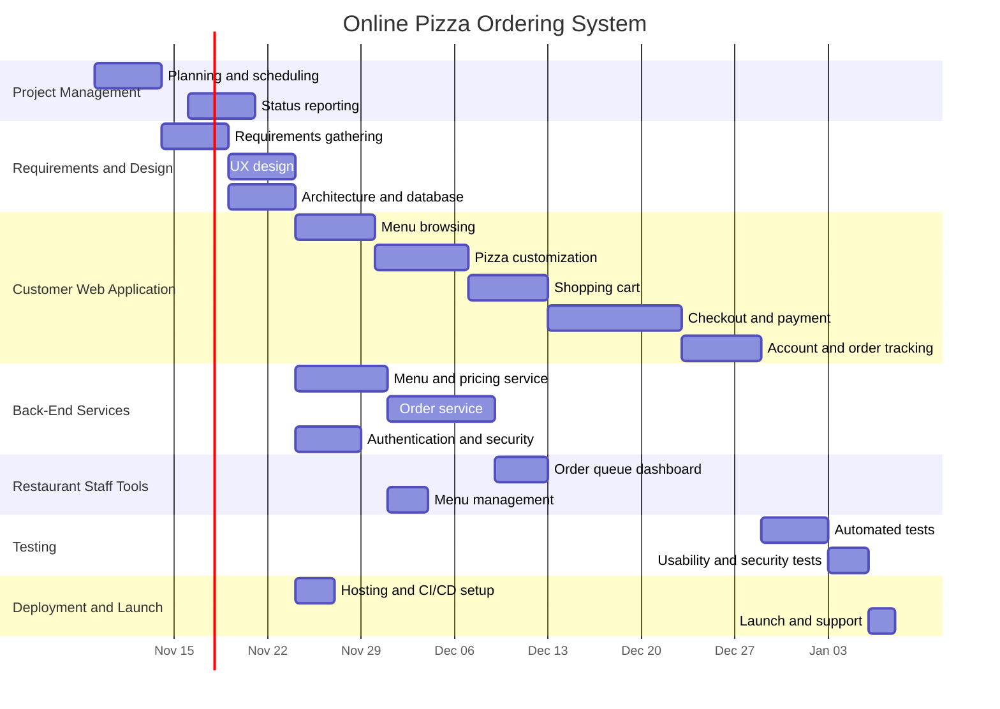

```mermaid
gantt
    title Online Pizza Ordering System
    dateFormat YYYY-MM-DD
    axisFormat %b %d

    section Project Management
    Planning and scheduling       :pm1, 2026-11-09, 5d
    Status reporting              :pm2, 2026-11-16, 5d

    section Requirements and Design
    Requirements gathering        :req1, after pm1, 5d
    UX design                     :req2, after req1, 5d
    Architecture and database     :req3, after req1, 5d

    section Customer Web Application
    Menu browsing                 :web1, after req2, 6d
    Pizza customization           :web2, after web1, 7d
    Shopping cart                 :web3, after web2, 6d
    Checkout and payment          :web4, after web3, 10d
    Account and order tracking    :web5, after web4, 6d

    section Back-End Services
    Menu and pricing service      :back1, after req3, 7d
    Order service                 :back2, after back1, 8d
    Authentication and security   :back3, after req3, 5d

    section Restaurant Staff Tools
    Order queue dashboard         :staff1, after back2, 4d
    Menu management               :staff2, after back1, 3d

    section Testing
    Automated tests               :test1, after web5, 5d
    Usability and security tests  :test2, after test1, 3d

    section Deployment and Launch
    Hosting and CI/CD setup       :deploy1, after req3, 3d
    Launch and support            :deploy2, after test2, 2d
```